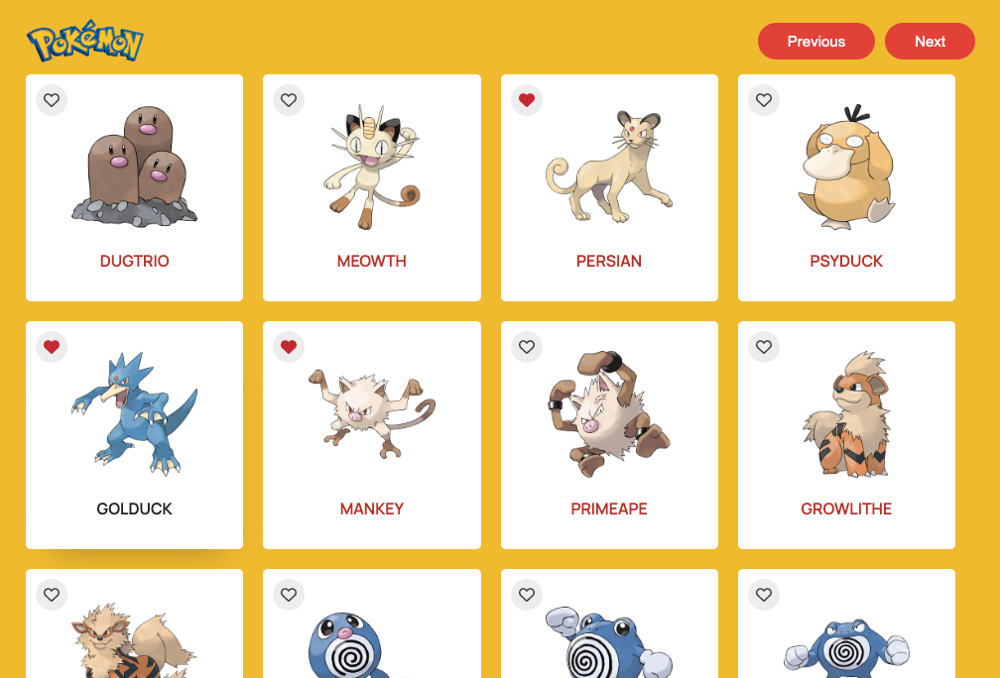

# Pokemon React App

Pokemon App is a React web application where you can navigate the details of the different pokemon by clicking on the list of 50 pokemons displayed per page. It has the favourite functionality with which you can favourite your pokemon by clicking on.

## snapshot

## live demo

[Pokemon React App Demo](https://varungujjar-pokemon.netlify.app/)

This project was bootstrapped with [Create React App](https://github.com/facebook/create-react-app).

## Features

- A list of first 100 pokemon that appeared in the show.
- You can see the list of the pokemon by filtering them.
- When a pokemon is clicked you can see the details of the pokemon.
- You can navigate back to the home page by clicking on the logo or on the button below.

## Potential Features

- Responsive layout.
- Favourite your Pokemon.
- Tests for Listing and Detail

## Built with

- React
- HTML
- CSS
- JavaScript/ES6
- Typescript
- React Hooks
- React Router
- Redux
- React Redux
- Pokeapi
- Netlify

### Prerequisites

- Node
- Npm

### Setup

- git clone `https://github.com/varungujjar/pokemon-app.git`
- cd pokemon-app
- npm install
- npm run start

### Unit Tests

- npm test

## Authors

👤 **Varun Gujjar**

## 📝 License

This project is [Apache](lic.url) licensed.
